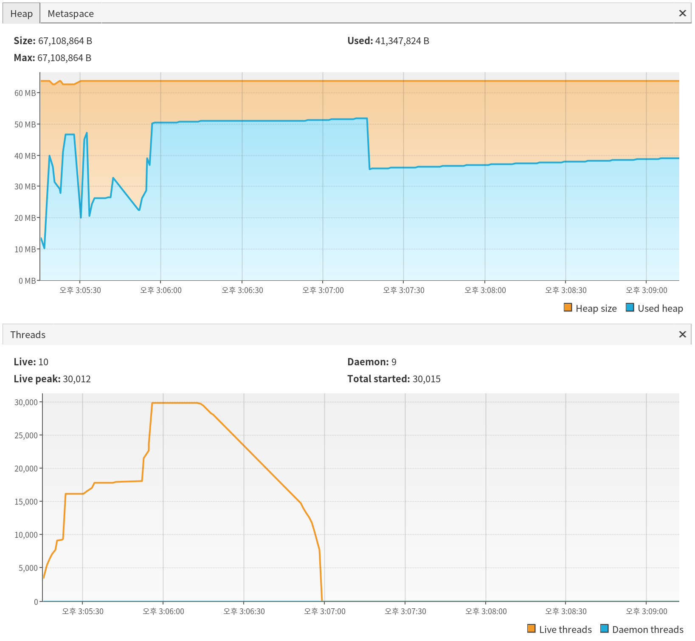
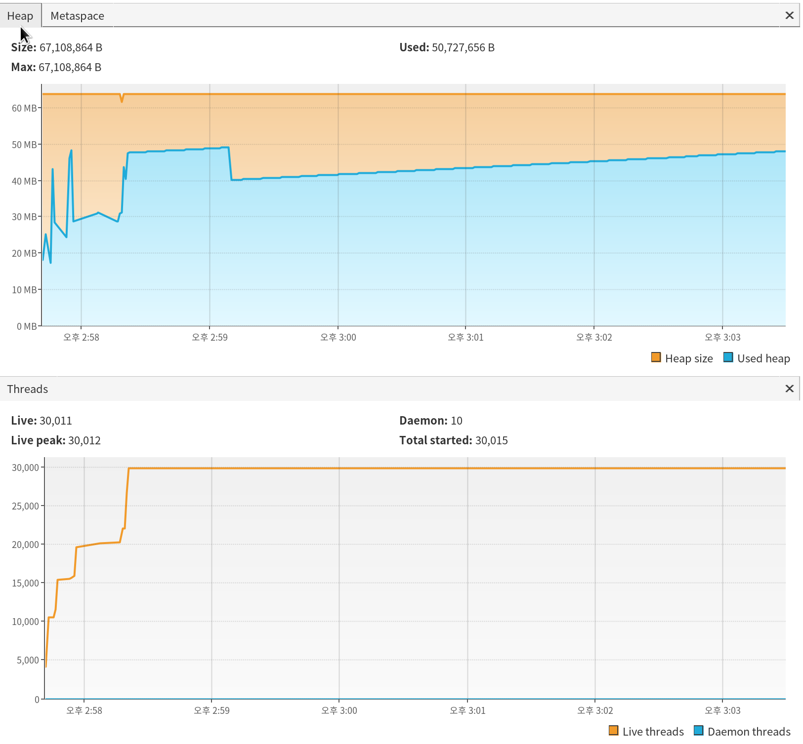

# Java 와 SpringFramework 의 Thread Pool 작동 방식 테스트
* Java의 `Executors.newCachedThreadPool()`과 `Executors.newFixedThreadPool(갯수)`
* SpringFramework 의 `ThreadPoolTaskExecutor` 설정에 따른 작동 방식 변화.
* 위 두가지를 실제 코드로 확인해보기.

## 최대 쓰레드 갯수
* [Java: What is the limit to the number of threads you can create? | Vanilla #Java](http://vanillajava.blogspot.com/2011/07/java-what-is-limit-to-number-of-threads.html)
* 위 문서에 따르면 64Bit Linux 에서 32,072 개의 쓰레드가 생성가능함.

## java.util.concurrent.ThreadPoolExecutor
* [java.util.concurrent.ThreadPoolExecutor](https://docs.oracle.com/en/java/javase/11/docs/api/java.base/java/util/concurrent/ThreadPoolExecutor.html)
* [Executors](https://docs.oracle.com/en/java/javase/11/docs/api/java.base/java/util/concurrent/Executors.html) 와
 SpringFramework의 [ThreadPoolTaskExecutor](https://docs.spring.io/spring-framework/docs/current/javadoc-api/org/springframework/scheduling/concurrent/ThreadPoolTaskExecutor.html) 가
 사용하는 쓰레드 풀 구현체
* 기본적으로 `corePoolSize` 만큼의 쓰레드를 만들고,
* `corePool`이 꽉차면 `workQueue`(`queueCapacity` 만큼의 크기로 된 큐)에 넣는데
* `workQueue`조차도 꽉차면 그제서야 `maxPoolSize` 까지 쓰레드를 생성해가면서 작업.
* 따라서 `corePoolSize`가 0이 아니고 일정 수준 이상되고 `queueCapacity`가 매우 크다면(보통 `Integer.MAX_VALUE`) 별다른 문제가 없는한
쓰레드 풀의 크기는 `corePoolSize`를 넘길 수 없다.

## ThreadPoolTaskExecutor 를 CachedThreadPool 처럼 사용하는 방법
* `corePoolSize` : `0`
* `maxPoolSize` : `Integer.MAX_VALUE`
* `queueCapacity` : `0`

## ThreadPoolTaskExecutor 를 FixedThreadPool 처럼 사용하는 방법
*  `corePoolSize` : 원하는 고정 크기 쓰레드 갯수
* `maxPoolSize` : `corePoolSize`와 동일하게.
* `queueCapacity` : `Integer.MAX_VALUE`
* 위와 같이 설정하면 실제로는 `corePoolSize` 만큼만 쓰레드가 생성된다.
* 만약 쓰레드가 적체되어 `corePoolSize` 이상의 작업이 들어오면 `workQueue` 에 `queueCapacity`만큼 들어가고,
 `corePool` 에 남는 자리가 생기면 `workQueue`에 있던것이 들어간다.
* `queueCapacity=Integer.MAX_VALUE`일 경우에는 여기까지 가는 것은 불가능하다고 보는게 맞다.
  만약 `queueCapacity`를 넘어간다면 이미 그 자체로 커다란 문제가 발생한 것이다.

## 결론 부터 먼저
*  `Executors.newCachedThreadPool()` 혹은 `ThreadPoolTaskExecutor`를 CachedThreadPool과 유사하게 설정하면
 쓰레드의 작업이 적체될 경우 시스템 한계치에 달하는 쓰레드를 생성하다가 죽어버린다.
* 따라서, 
  * cachedThreadPool 이 필요한 경우
    * **명확하게 정말 빠르게 끝나는 task 만 할당하는게 확실할 경우**에는 cachedThreadPool 혹은 이에 준하는 설정이 낫다.
    * cachedThreadPool 은 **항상 필요한 만큼만 쓰레드를 생성하고, 불필요해지면 자동으로 쓰레드를 반환**하므로 
    최적 상태가 된다.
    * **지연이 발생할 가능성이 있다면 cachedThreadPool 의 경우 Java 프로세스가 수만개의 쓰레드를 생성하다가 죽을 수 있다.**
  * 쓰레드 작업에 적체가 발생할 가능성이 큰 경우에는 fixedThreadPool을 사용하는게 나아보인다.
      * `Executors.newFixedThreadPool(적당한쓰레드갯수)` 를 사용하거나, 
      * `ThreadPoolTaskExecutor`를 위에 설명한 대로 설정한다.
      * 단점은, 일단 `corePoolSize` 만큼의 쓰레드가 생성되면 불필요하게 항상 고정 크기 쓰레드가 생성된 상태로 유지된다.
       실제로 사용되지 않아도 유지된다.
      * 쓰레드 생성요청이 매우 많이 들어와도 애플리케이션이 죽지는 않지만 해당 쓰레드풀을 사용하는 작업이 
      매우 느려지기만 한다.
* SpringFramework 에서는 `ThreadPoolTaskExecutor`를 사용한다.
  * Spring 이 자동으로 bean lifecycle 을 관리해준다. 
  * 따라서 애플리케이션 종료시 shutdown 을 해준다. 

## EXECUTOR_SERVICE_CACHED
* `Executors.newCachedThreadPool()` 사용.
```
./gradlew run --args="EXECUTOR_SERVICE_CACHED"
```
* 결과
  * 총 쓰레드 32600 개를 생성하고 죽음. 가끔씩 task가 처리되는 시간에 따라
   안죽을 때도 있으나 쓰레드를 수만개 생성해서 메모리가 폭주하는 것은 마찬가지임.
  * 일부 쓰레드 작업을 마쳤으나 대부분 `sleep interrupted`
  * `# after thread generation ...`, `# The end` 출력안됨. 즉, 쓰레드 생성 반복문을 마치지도 못했음.
* 결과 출력 
```
# current thread [pool-1-thread-32597] idx : 32596, current active thread count 32599
# current thread [pool-1-thread-32598] idx : 32597, current active thread count 32600
#
# There is insufficient memory for the Java Runtime Environment to continue.
# Native memory allocation (mmap) failed to map 12288 bytes for committing reserved memory.
# An error report file with more information is saved as:
# .../java-spring-thread-pool-test/hs_err_pid945971.log
[thread 140060855953152 also had an error]

OpenJDK 64-Bit Server VM warning: INFO: os::commit_memory(0x00007f58dad0b000, 12288, 0) failed; error='메모리를 할당할 수 없습니다' (errno=12)
Exception in thread "main" java.lang.OutOfMemoryError: unable to create new native thread
        at java.lang.Thread.start0(Native Method)
        at java.lang.Thread.start(Thread.java:717)
        at java.util.concurrent.ThreadPoolExecutor.addWorker(ThreadPoolExecutor.java:957)
        at java.util.concurrent.ThreadPoolExecutor.execute(ThreadPoolExecutor.java:1378)
        at kr.pe.kwonnam.java_spring_threadpool.ThreadPoolTester.main(ThreadPoolTester.java:43)
OpenJDK 64-Bit Server VM warning: Attempt to deallocate stack guard pages failed.
OpenJDK 64-Bit Server VM warning: INFO: os::commit_memory(0x00007f627580f000, 12288, 0) failed; error='메모리를 할당할 수 없습니다' (errno=12)

# shutting down executor

```
* 참고
  * `ExecutorService.newCachedThreadPool()` 는 `corePoolSize=0`, `maxPoolSize=Integer.MAX_VALUE`, workQueue 로 `SynchronousQueue`를 사용하는데,
  * 이는 항상 poll 해가는 쓰레드가 존재할 때만 insert 를 할 수 있는 큐이다(queue size를 항상 0으로 유지).
  * 즉, 비록 corePoolSize 가 0 이라해도 뭔가 쓰레드 생성을 요청하는 순간 queue 에 넣고 빼가는게 즉시 이뤄져서
  항상 필요한만큼의 쓰레드가 즉시 생성된다.
```
return new ThreadPoolExecutor(0, Integer.MAX_VALUE,
                              60L, TimeUnit.SECONDS,
                              new SynchronousQueue<Runnable>());
```
## EXECUTOR_SERVICE_FIXED_1000
* `Executors.newFixedThreadPool(1000)` 사용.
```
./gradlew run --args="EXECUTOR_SERVICE_FIXED_1000" 
```
* 결과
  * 쓰레드 생성 반복문 직후 찍는 `after thread generation ...`가 1000개의 쓰레드의 시작 실행 구문이 찍힌 뒤에
  출력된 것으로 보아, **workQueue 가 존재하여 이미 모든 쓰레드 정보는 queue에 다들어간 생태** 임을 알 수 있다.
  * 계속 `1001`개의 쓰레드 갯수를 유지했다.
  * 느리지만 끝까지 문제 없이 실행됐다.
* 참고 : `workQueue`
  * `newFixedThreadPool()` 은 내부적으로 `workQueue` 를 다음과 같이 생성하는데, 
  해당 코드를 보면 `Integer.MAX_VALUE` 크기의 큐를 생성하는 것을 볼 수 있다.

```
// java.util.concurrent.LinkedBlockingQueue.LinkedBlockingQueue()

    /**
     * Creates a {@code LinkedBlockingQueue} with a capacity of
     * {@link Integer#MAX_VALUE}.
     */
    public LinkedBlockingQueue() {
        this(Integer.MAX_VALUE);
    }
```
```
# current thread [pool-1-thread-999] idx : 998, current active thread count 1001
# current thread [pool-1-thread-1000] idx : 999, current active thread count 1001
# after thread generation ...
# current thread [pool-1-thread-1] idx : 0, , current active thread count 1001, countDownLatch : 49998 END
# current thread [pool-1-thread-27] idx : 26, , current active thread count 1001, countDownLatch : 49986 END
....
# current thread [pool-1-thread-970] idx : 49997, , current active thread count 1001, countDownLatch : 2 END
# current thread [pool-1-thread-643] idx : 49998, , current active thread count 1001, countDownLatch : 1 END
# The end
# shutting down executor
# current thread [pool-1-thread-247] idx : 49999, , current active thread count 1001, countDownLatch : 0 END
```

## THREAD_POOL_TASK_EXECUTOR_CORE_POOL_SIZE_AND_QUEUE_0
* `ThreadPoolTaskExecutor` == `Executors.newCachedThreadPool()` 유사한 설정
  * `corePoolSize` : `0` - 쓰레드 풀이 반환되면 일정 시간 기다렸다가 0개로 줄인다.
  * `maxPoolSize` : `Integer.MAX_VALUE`
  * `queueCapacity` : `0` - 큐가 없으므로 `maxPoolSize`만큼 즉각 증가시킨다.
```
./gradlew run --args="THREAD_POOL_TASK_EXECUTOR_CORE_POOL_SIZE_AND_QUEUE_0" 
```
* 결과
  * 총 쓰레드 32596 개를 생성하고 죽음.
  * 한개의 쓰레드도 작업을 마치지 못함.
  * `# after thread generation ...` 출력안됨. 즉, 쓰레드 생성 반복문을 마치지도 못했음.
  * `Executors.newCachedThreadPool()`과 동일한 결과

```
# current thread [MYTHREADPOOL-32589] idx : 32588, current active thread count 32591
# current thread [MYTHREADPOOL-32590] idx : 32589, current active thread count 32592
OpenJDK 64-Bit Server VM warning: Attempt to protect stack guard pages failed.
# current thread [MYTHREADPOOL-32591] idx : 32590, current active thread count 32593
OpenJDK 64-Bit Server VM warning: Attempt to protect stack guard pages failed.
# current thread [MYTHREADPOOL-32592] idx : 32591, current active thread count 32594
OpenJDK 64-Bit Server VM warning: Attempt to protect stack guard pages failed.
# current thread [MYTHREADPOOL-32594] idx : 32593, current active thread count 32596
OpenJDK 64-Bit Server VM warning: INFO: os::commit_memory(0x00007f74311b0000, 12288, 0) failed; error='메모리를 할당할 수 없습니다' (errno=12)
#
# There is insufficient memory for the Java Runtime Environment to continue.
# Native memory allocation (mmap) failed to map 12288 bytes for committing reserved memory.
# An error report file with more information is saved as:
# .../java-spring-thread-pool-test/hs_err_pid111281.log
[thread 140137015731968 also had an error]
OpenJDK 64-Bit Server VM warning: INFO: os::commit_memory(0x00007f7430fae000, 12288, 0) failed; error='메모리를 할당할 수 없습니다' (errno=12)
# shutting down executor
[thread 140178252187392 also had an error]

```

## THREAD_POOL_TASK_EXECUTOR_QUEUE_INTMAX
* `ThreadPoolTaskExecutor` == `Executors.newFixedThreadPool()` 유사한 설정
  * `corePoolSize` : `1000` - 쓰레드 풀 항상 1000개 유지
  * `maxPoolSize` : `1000`
  * `queueCapacity` : `Integer.MAX_VALUE`
```
./gradlew run --args="THREAD_POOL_TASK_EXECUTOR_QUEUE_INTMAX" 
```

* 결과
  * `idx: 999` 에서  `# after thread generation ...` 가 출렸됐다는 것은 이 시점에는 이미 
  쓰레드 풀 `workQueue` 에 모든 요청이 들어갔다는 의미임.
  * 최대 쓰레드 갯수 1001개를 유지하면서 느리지만 모든 작업을 무사히 마침.
  * `Executors.newFixedThreadPool(1000)`와 동일한 결과
  
```
# current thread [MYTHREADPOOL-999] idx : 998, current active thread count 1001
# current thread [MYTHREADPOOL-1000] idx : 999, current active thread count 1001
# after thread generation ...
# current thread [MYTHREADPOOL-1] idx : 0, , current active thread count 1001, countDownLatch : 49999 END
# current thread [MYTHREADPOOL-3] idx : 2, , current active thread count 1001, countDownLatch : 49998 END
# current thread [MYTHREADPOOL-1] idx : 1000, current active thread count 1001

....
# current thread [MYTHREADPOOL-572] idx : 49997, , current active thread count 1001, countDownLatch : 2 END
# current thread [MYTHREADPOOL-984] idx : 49998, , current active thread count 1001, countDownLatch : 1 END
# current thread [MYTHREADPOOL-507] idx : 49999, , current active thread count 1001, countDownLatch : 0 END
# The end
# shutting down executor
```

## THREAD_POOL_TASK_EXECUTOR_MAX_INTMAX_QUEUE_40000
* `corePoolSize`, `maxPoolSize`, `queueCapacity`의 관계를 보여주는 예제.
  * `corePoolSize` : `1000`
  * `maxPoolSize` : `Integer.MAX_VALUE`
  * `queueCapacity` : `40,000`
```
./gradlew run --args="THREAD_POOL_TASK_EXECUTOR_MAX_INTMAX_QUEUE_40000" 
```

* 결과
  * 작업을 총 50,000개 생성하는데, `idx=999`까지만 쓰레드를 생성하다가 그 이후에는 queue에 넣다가
  * queue 가 꽉차는 41,000 개 째부터 더이상 queue에 넣을 수 없어서 `maxPoolSize=Integer.MAX_VALUE`에 따라 Thread를
  생성하기 시작하는 것을 볼 수 있다.
  * 쓰레드가 `총 생성 작업갯수(50,000)-queueSize(40,000)`즈음인 `10001`에 이르자, queue도 꽉차고 queue에 못 넣은 것은 
  corePoolSize를 넘어서는 갯수의 쓰레드를 생성함으로써
  모두 다 할당이 완료되었기 때문에 그 순간 `# after thread generation ...`이 출력되면서
  모든 작업을 threadPool에 넣는 것이 완료됨을 볼 수 있다.
  * 쓰레드 갯수가 한계 수치인 `30,000`개 이상까지 가지 않고 `10,001`에 계속 머물렀기 때문에 모든 작업을 완료하였다.

```
# current thread [MYTHREADPOOL-997] idx : 996, current active thread count 999
# current thread [MYTHREADPOOL-998] idx : 997, current active thread count 1000
# current thread [MYTHREADPOOL-999] idx : 998, current active thread count 1001
# current thread [MYTHREADPOOL-1000] idx : 999, current active thread count 1001

# current thread [MYTHREADPOOL-1001] idx : 41000, current active thread count 1003
# current thread [MYTHREADPOOL-1002] idx : 41001, current active thread count 1004
# current thread [MYTHREADPOOL-1003] idx : 41002, current active thread count 1005
# current thread [MYTHREADPOOL-1004] idx : 41003, current active thread count 1006
....
# current thread [MYTHREADPOOL-9998] idx : 49997, current active thread count 10000
# current thread [MYTHREADPOOL-9999] idx : 49998, current active thread count 10001
# after thread generation ...
# current thread [MYTHREADPOOL-10000] idx : 49999, current active thread count 10001
# current thread [MYTHREADPOOL-1] idx : 0, , current active thread count 10001, countDownLatch : 49999 END
# current thread [MYTHREADPOOL-5] idx : 4, , current active thread count 10001, countDownLatch : 49998 END

....
# current thread [MYTHREADPOOL-8673] idx : 40950, , current active thread count 10001, countDownLatch : 38 END
# current thread [MYTHREADPOOL-8663] idx : 40952, , current active thread count 10001, countDownLatch : 39 END
# current thread [MYTHREADPOOL-8660] idx : 40961, , current active thread count 10001, countDownLatch : 40 END
# current thread [MYTHREADPOOL-8657] idx : 40959, , current active thread count 10001, countDownLatch : 42 END
# The end
# shutting down executor
# current thread [MYTHREADPOOL-8665] idx : 40958, , current active thread count 10001, countDownLatch : 43 END
# current thread [MYTHREADPOOL-8654] idx : 40957, , current active thread count 10001, countDownLatch : 44 END
# current thread [MYTHREADPOOL-8662] idx : 40955, , current active thread count 10001, countDownLatch : 46 END
# current thread [MYTHREADPOOL-8668] idx : 40948, , current active thread count 10001, countDownLatch : 47 END
# current thread [MYTHREADPOOL-8658] idx : 40949, , current active thread count 10001, countDownLatch : 49 END
# current thread [MYTHREADPOOL-8633] idx : 40999, , current active thread count 10001, countDownLatch : 0 END
# current thread [MYTHREADPOOL-8637] idx : 40997, , current active thread count 10001, countDownLatch : 2 END
```

## THREAD_POOL_TASK_EXECUTOR_MAX_LIMITED_QUEUE_0
* `maxPoolSize`에 다다르면 예외가 발생함을 보여주는 예제. queue를 없애고, maxPoolSize를 작게 잡았다.
  * `corePoolSize` : `1000`
  * `maxPoolSize` : `2000` 
  * `queueCapacity` : `0`

```
./gradlew run --args="THREAD_POOL_TASK_EXECUTOR_MAX_LIMITED_QUEUE_0" 
```

* 결과
  * 첫 코드는 `try/catch`로 감싸지 않았는데, 2000개의 작업을 넣고나서 멈춰버렸다.
  * `# after thread generation ...`, `# The end` 둘다 출력이 안된다.
  * `finally` block 의 `# shutting down executor`만 출력됐다. 즉, 예외가 발생했음을 뜻한다.
  * 2000개 이상 작업을 넣으려고 하면 예외가 발생한다.
    * `Exception in thread "main" org.springframework.core.task.TaskRejectedException: Executor [java.util.concurrent.ThreadPoolExecutor@479d31f3[Running, pool size = 2000, active threads = 2000, queued tasks = 0, completed tasks = 0]] did not accept task: kr.pe.kwonnam.java_spring_threadpool.ThreadPoolTester$$Lambda$3/1598924227@333291e3`
    * `Caused by: java.util.concurrent.RejectedExecutionException: Task kr.pe.kwonnam.java_spring_threadpool.ThreadPoolTester$$Lambda$3/1598924227@333291e3 rejected from java.util.concurrent.ThreadPoolExecutor@479d31f3[Running, pool size = 2000, active threads = 2000, queued tasks = 0, completed tasks = 0]`
  * `shutdown`이 호출됐기 때문에 이미 쓰레드 풀에 들어간 작업은 수행이 잘 종료됐고, active thread count 도 줄어들었다.
  * (처음에 try/finally로 감싸기 전에는) `main` 쓰레드가 Lock 대기 상태에 들어갔다.
    * 이미 main 쓰레드에서 `try/catch` 없이 Exception 이 발생했으므로 `CountDownLatch.await()` 때문은 아니다.
    * `main` 쓰레드는 이미 종료되었고 `DestroyJavaVM` 쓰레드가 활성화된 상태로 Lock 대기 상태에 빠짐.
    * `try/finally` 블럭으로 감싸고, finally 에서 executor shutdown을 해주면 잘 종료된다.

```
# current thread [MYTHREADPOOL-1998] idx : 1997, current active thread count 2000
# current thread [MYTHREADPOOL-1999] idx : 1998, current active thread count 2001
# current thread [MYTHREADPOOL-2000] idx : 1999, current active thread count 2001
# shutting down executor
...
# current thread [MYTHREADPOOL-1994] idx : 1993, , current active thread count 8, countDownLatch : 48006 END
# current thread [MYTHREADPOOL-1995] idx : 1994, , current active thread count 7, countDownLatch : 48005 END
# current thread [MYTHREADPOOL-1996] idx : 1995, , current active thread count 6, countDownLatch : 48004 END
# current thread [MYTHREADPOOL-1997] idx : 1996, , current active thread count 5, countDownLatch : 48003 END
# current thread [MYTHREADPOOL-1998] idx : 1997, , current active thread count 4, countDownLatch : 48002 END
# current thread [MYTHREADPOOL-1999] idx : 1998, , current active thread count 3, countDownLatch : 48001 END
# current thread [MYTHREADPOOL-2000] idx : 1999, , current active thread count 2, countDownLatch : 48000 END
Exception in thread "main" org.springframework.core.task.TaskRejectedException: Executor [java.util.concurrent.ThreadPoolExecutor@479d31f3[Running, pool size = 2000, active threads = 2000, queued tasks = 0, completed tasks = 0]] did not accept task: kr.pe.kwonnam.java_spring_threadpool.ThreadPoolTester$$Lambda$3/1598924227@333291e3
┆...at org.springframework.scheduling.concurrent.ThreadPoolTaskExecutor.execute(ThreadPoolTaskExecutor.java:324)
┆...at kr.pe.kwonnam.java_spring_threadpool.ThreadPoolTester.main(ThreadPoolTester.java:45)
Caused by: java.util.concurrent.RejectedExecutionException: Task kr.pe.kwonnam.java_spring_threadpool.ThreadPoolTester$$Lambda$3/1598924227@333291e3 rejected from java.util.concurrent.ThreadPoolExecutor@479d31f3[Running, pool size = 2000, active threads = 2000, queued tasks = 0, completed tasks = 0]
┆...at java.util.concurrent.ThreadPoolExecutor$AbortPolicy.rejectedExecution(ThreadPoolExecutor.java:2063)
┆...at java.util.concurrent.ThreadPoolExecutor.reject(ThreadPoolExecutor.java:830)
┆...at java.util.concurrent.ThreadPoolExecutor.execute(ThreadPoolExecutor.java:1379)
┆...at org.springframework.scheduling.concurrent.ThreadPoolTaskExecutor.execute(ThreadPoolTaskExecutor.java:321)
┆...... 1 more
```

## FORK_JOIN_COMMON_POOL
* `java.util.concurrent.ForkJoinPool.commonPool()`
  * 아무 설정이 없으면 CPU Thread 갯수만큼의 크기(`Runtime.getRuntime().availableProcessors()`)로 쓰레드 풀을 생성한다.
  * `Intel(R) Core(TM) i7-9750H CPU` 에서 12 개 크기로 생성됨.
  * 너무 적게 생성되고 자동 확장이 일어나지 않으므로 주의해서 사용한다.
  * System Property `java.util.concurrent.ForkJoinPool.common.parallelism=1000` 형태로 쓰레드 풀의 크기를 명시할 수 있다.

```
./gradlew run --args="FORK_JOIN_COMMON_POOL" 
```
* 결과
  * 11개 정도의 쓰레드가 시작되자 `# after thread generation ...` 이 출력되었으므로, Thread 에 `workQueue`가 존재하고 모든 요청이 큐에 적재됐음을 뜻한다.
  * `current active thread count 12` 로 항상 12개의 쓰레드를 유지하고 있다.
  * main 포함 13개여야 하는데 12개만 active 이고, 다른 작업이 끝난 뒤에 idx 12 번이 `# current thread [ForkJoinPool.commonPool-worker-15] idx : 12, current active thread count 12` 이렇게 시작되었다.
   즉, 쓰레드 풀이 실제로는 11개만 작동하고 있다.
  * `# The end`와 `# shutting down executor` 마지막에 함께 출력되면서 무사히 작어을 마쳤다.
```
# Starting with Thread Pool FORK_JOIN_COMMON_POOL
current java.util.concurrent.ForkJoinPool.common.parallelism : null
# current thread [ForkJoinPool.commonPool-worker-9] idx : 0, current active thread count 6
# current thread [ForkJoinPool.commonPool-worker-2] idx : 1, current active thread count 6
# current thread [ForkJoinPool.commonPool-worker-11] idx : 2, current active thread count 6
# current thread [ForkJoinPool.commonPool-worker-6] idx : 5, current active thread count 12
# current thread [ForkJoinPool.commonPool-worker-13] idx : 4, current active thread count 11
# current thread [ForkJoinPool.commonPool-worker-4] idx : 3, current active thread count 10
# current thread [ForkJoinPool.commonPool-worker-8] idx : 6, current active thread count 10
# current thread [ForkJoinPool.commonPool-worker-3] idx : 10, current active thread count 12
# current thread [ForkJoinPool.commonPool-worker-10] idx : 9, current active thread count 12
# current thread [ForkJoinPool.commonPool-worker-1] idx : 8, current active thread count 12
# current thread [ForkJoinPool.commonPool-worker-15] idx : 7, current active thread count 12
# after thread generation ...
# current thread [ForkJoinPool.commonPool-worker-9] idx : 0, , current active thread count 12, countDownLatch : 49997 END
# current thread [ForkJoinPool.commonPool-worker-15] idx : 7, , current active thread count 12, countDownLatch : 49989 END
# current thread [ForkJoinPool.commonPool-worker-15] idx : 12, current active thread count 12

.....

# current thread [ForkJoinPool.commonPool-worker-11] idx : 49997, , current active thread count 12, countDownLatch : 2 END
# current thread [ForkJoinPool.commonPool-worker-2] idx : 49998, , current active thread count 12, countDownLatch : 1 END
# current thread [ForkJoinPool.commonPool-worker-6] idx : 49999, , current active thread count 12, countDownLatch : 0 END
# The end
# shutting down executor
```

## FORK_JOIN_COMMON_POOL_PARALLELISM_1000
* `java.util.concurrent.ForkJoinPool.commonPool()` 이지만 `parallelism` 을 `1000` 으로 지정하였다.
  * `System.setProperty("java.util.concurrent.ForkJoinPool.common.parallelism", "1000");`
```
./gradlew run --args="FORK_JOIN_COMMON_POOL_PARALLELISM_1000" 
```

* 결과
  * 실행순서가 상당히 뒤죽박죽이다.
  * 다른 쓰레드 풀(`ThreadPoolExecutor` 기반)은 Java Heap Size와 무관하게 작동하였는데, `ForkJoinPool`은 Heap Size에 따라 메모리 할당을 못하는 현상이 발생하였다.
  * Pool 사이즈가 `1000`이 되기 이전에 `# after thread generation ...`가 출력되었다. 
  * `# after thread generation ...` 가 출력되었으므로 `workQueue`에 모든 작업이 들어갔다.
  * 중간에 Memory 부족이 발생했으나, 일부 쓰레드만 실패하고, 계속 진행되었다.
  * 계속 작업은 진행되고 시스템 다운도 안되지만, `# The end` 는 출력되지 않는다.
  * `OutOfMemory`로 실행되지 못한 쓰레드들이 `CountDownLatch`를 제대로 줄여주지 못해서 `countDownLatch.await();` 부분에 영원히 멈춰있게 된다.
    * `java.util.concurrent.CountDownLatch.await(CountDownLatch.java:231)`
  * `-Xmx4g` 옵션을 주고 실행하면 모두 정상 실행 및 종료된다.
```
# 최종 멈춘 상태에서의 main thread dump
"main" #1 prio=5 os_prio=0 tid=0x00007f2c6800c000 nid=0xb39b waiting on condition [0x00007f2c6d051000]
   java.lang.Thread.State: WAITING (parking)
	at sun.misc.Unsafe.park(Native Method)
	- parking to wait for  <0x00000000fe2e62d0> (a java.util.concurrent.CountDownLatch$Sync)
	at java.util.concurrent.locks.LockSupport.park(LockSupport.java:175)
	at java.util.concurrent.locks.AbstractQueuedSynchronizer.parkAndCheckInterrupt(AbstractQueuedSynchronizer.java:836)
	at java.util.concurrent.locks.AbstractQueuedSynchronizer.doAcquireSharedInterruptibly(AbstractQueuedSynchronizer.java:997)
	at java.util.concurrent.locks.AbstractQueuedSynchronizer.acquireSharedInterruptibly(AbstractQueuedSynchronizer.java:1304)
	at java.util.concurrent.CountDownLatch.await(CountDownLatch.java:231)
	at kr.pe.kwonnam.java_spring_threadpool.ThreadPoolTester.main(ThreadPoolTester.java:61)
```
  
```
# Starting with Thread Pool FORK_JOIN_COMMON_POOL_PARALLELISM_1000
current java.util.concurrent.ForkJoinPool.common.parallelism : 1000
# current thread [ForkJoinPool.commonPool-worker-441] idx : 0, current active thread count 5
# current thread [ForkJoinPool.commonPool-worker-740] idx : 3, current active thread count 7
# current thread [ForkJoinPool.commonPool-worker-15] idx : 6, current active thread count 10
# current thread [ForkJoinPool.commonPool-worker-299] idx : 2, current active thread count 6

# current thread [ForkJoinPool.commonPool-worker-247] idx : 46, current active thread count 56
# current thread [ForkJoinPool.commonPool-worker-546] idx : 51, current active thread count 59
# after thread generation ...
# current thread [ForkJoinPool.commonPool-worker-688] idx : 48, current active thread count 59
# current thread [ForkJoinPool.commonPool-worker-120] idx : 54, current active thread count 60

...
Exception in thread "ForkJoinPool.commonPool-worker-918" Exception in thread "ForkJoinPool.commonPool-worker-335" Exception in thread "ForkJoinPool.commonPool-worker-193" Exception in thread "ForkJoinPool.commonPool-worker-776" # current thread [ForkJoinPool.commonPool-worker-604] idx : 827, current active thread count 836
Exception in thread "ForkJoinPool.commonPool-worker-634" # current thread [ForkJoinPool.commonPool-worker-477] idx : 836, current active thread count 843
# current thread [ForkJoinPool.commonPool-worker-36] idx : 835, current active thread count 842
# current thread [ForkJoinPool.commonPool-worker-21] idx : 830, current active thread count 842
# current thread [ForkJoinPool.commonPool-worker-903] idx : 832, current active thread count 841
java.lang.OutOfMemoryError: Java heap space# current thread [ForkJoinPool.commonPool-worker-619] idx : 
833, current active thread count 841
# current thread [ForkJoinPool.commonPool-worker-178] idx : 834, current active thread count java.lang.OutOfMemoryError: Java heap space
java.lang.OutOfMemoryError: Java heap space
841
# current thread [ForkJoinPool.commonPool-worker-320	at java.util.concurrent.ForkJoinPool$WorkQueue.growArray(ForkJoinPool.java:886)
] idx : 	at java.util.concurrent.ForkJoinPool.runWorker(ForkJoinPool.java:1687)
	at java.util.concurrent.ForkJoinWorkerThread.run(ForkJoinWorkerThread.java:157)
829, current active thread count 837
java.lang.OutOfMemoryError: Java heap space
# current thread [ForkJoinPool.commonPool-worker-462] idx : 	at java.util.concurrent.ForkJoinPool$WorkQueue.growArray(ForkJoinPool.java:886)
828, current active thread count 	at java.util.concurrent.ForkJoinPool.runWorker(ForkJoinPool.java:1687)
	at java.util.concurrent.ForkJoinWorkerThread.run(ForkJoinWorkerThread.java:157)
837
# current thread [ForkJoinPool.commonPool-worker-761] idx : 831, current active thread count 837
java.lang.OutOfMemoryError: Java heap space
# current thread [ForkJoinPool.commonPool-worker-441] idx : 0, , current active thread count 838, countDownLatch : 49998 END

# current thread [ForkJoinPool.commonPool-worker-845] idx : 49891, , current active thread count 906, countDownLatch : 533 END
# current thread [ForkJoinPool.commonPool-worker-660] idx : 49892, , current active thread count 906, countDownLatch : 532 END
```

## Thread 가 생성하는 메모리는 어디에?
* [memory - How does Java (JVM) allocate stack for each thread - Stack Overflow](https://stackoverflow.com/questions/36898701/how-does-java-jvm-allocate-stack-for-each-thread)
* Thread Stack 메모리는 Heap 과 무관한 별도의 영역에 생긴다.
* Linux 64bit 에서는 기본 Thread 하나당 1024kb(1mb)를 차지한다.
* 따라서 heap 사이즈를 매우 작게 해도 Thread 를 수만개 생성할 수 있다. 단, 쓰레드에서 힙을 적게 사용할 때한해서.

## 어째서 ForkJoinPool 에서 Java Heap OutOfMemory가 발생했나?
* `ForkJoinPool` 에서 Pool size가 1000 밖에 안되는데도 Java Heap OutOfMemory 가 발생했는데, 이는 `-Xmx32m` 설정 때문이다.
* Heap 이 너무 작았는데, `ForkJoinPool` 이 `workQueue`에 넣는 `ForkJoinTask`가 약 32mb 저도를 차지했기 때문에 발생했다.
* 일반적으로 64mb 이상의 Heap 만 할당했다고 하더라도 발생할 수 없는 오류였다.
* 따라서 `ForkJoinPool`이 쓰레드 생성을 위해서 heap 을 매번 사용한다고 생각할 필요는 없다.
* `ThreadPoolExecutor`도 `workQueue`를 `LinkedBlockingQueue` 로 생성하고 `LinkedBlockingQueue#Node` 객체를 생성하는데,
  이게 용량을 `ForkJoinTask` 보다 적게 사용하는 편이어서 `-Xmx32m`으로도 충분했다.


## shutdown 없이 Thread Pool 자체를 계속 생성하면?
* 결론부터
  * Thread Pool 은 목적에 따라 특정 갯수만 생성해서 계속해서 재사용하는 것이지, 매번 필요할 때마다 생성하는게 아니다.
  * Thread Pool 자체를 올바로 shutdown 하지 않고 계속 생성하면 제한 갯수에 다다르면 시스템이 다운되고,
  * cahcedThreadPool 은 사용하지 않는 쓰레드를 반환하지만 어쨌든 이미 생성한 쓰레드를 재사용하지 않는 것은 Pool 의 개념에 어긋나 성능이 저하될 것이고,
  * fixedThreadPool 은 이미 생성된 쓰레드를 반환하지 않기 때문에 결국 제한 갯수에 다다라서 crash 가 발생하게 될 것이다.

### TooManyCachedThreadPoolTester
* `Executors.newCachedThreadPool()` 를 계속 생성하고 shutdown 하지 않으면 제한 갯수(약 3만2천개)에 다다르면 시스템이 다운된다.
* 제한 갯수에 다다르지 않으면 저절로 Thread Pool 의 쓰레드가 줄어들면서 마지막에는 올바로 종료 가능한 상태가 된다.



### TooManyFixedThreadPoolTester
* `Executors.newFixedThreadPool(1)` 를 계속 생성하기 shutdown 하지 않으면 제한 갯수(약 3만2천개)에 다다르면 시스템이 다운된다.
* 제한 갯수에 다다르지 않더라도, fixedThreadPool 은 시간이 지나도 쓰레드를 반환하지 않고 계속해서 쓰레드 풀에 생성된 쓰레드를 유지한다.
* 이로 인해서 shutdown 을 명시적으로 하지 않고는 올바로 프로세스가 종료되지 않는다.
* Thread Pool 에 있는 쓰레드가 daemon thread 가 아니기 때문이다.



```
newFiexedThreadPool(1) idx 32581 - current Active Thread count 32584
newFiexedThreadPool(1) idx 32582 - current Active Thread count 32585
#
# There is insufficient memory for the Java Runtime Environment to continue.
# Native memory allocation (mmap) failed to map 12288 bytes for committing reserved memory.
# An error report file with more information is saved as:
# ..../java-spring-thread-pool-test/hs_err_pid1396904.log
OpenJDK 64-Bit Server VM warning: Attempt to protect stack guard pages failed.
OpenJDK 64-Bit Server VM warning: Attempt to protect stack guard pages failed.
OpenJDK 64-Bit Server VM warning: Attempt to deallocate stack guard pages failed.
Exception in thread "main" java.lang.OutOfMemoryError: unable to create new native thread
	at java.lang.Thread.start0(Native Method)
	at java.lang.Thread.start(Thread.java:717)
	at java.util.concurrent.ThreadPoolExecutor.addWorker(ThreadPoolExecutor.java:957)
	at java.util.concurrent.ThreadPoolExecutor.execute(ThreadPoolExecutor.java:1367)
	at java.util.concurrent.AbstractExecutorService.submit(AbstractExecutorService.java:112)
	at kr.pe.kwonnam.java_spring_threadpool.TooManyFixedThreadPoolTester.main(TooManyFixedThreadPoolTester.java:11)
OpenJDK 64-Bit Server VM warning: Attempt to deallocate stack guard pages failed.
OpenJDK 64-Bit Server VM warning: INFO: os::commit_memory(0x00007f6d1c10d000, 12288, 0) failed; error='메모리를 할당할 수 없습니다' (errno=12)
```